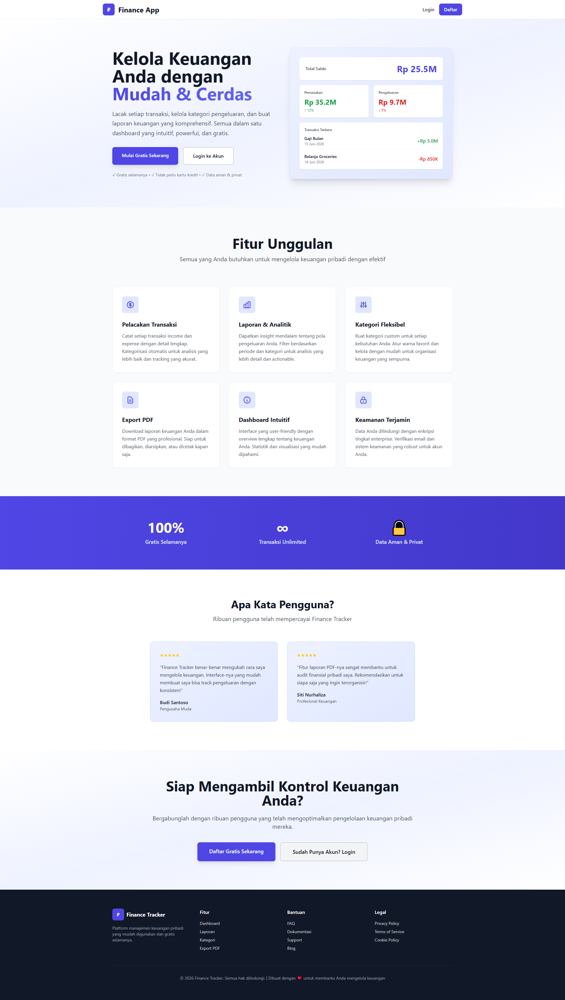

# 💰 Finance App - Aplikasi Catatan Keuangan

Aplikasi web untuk mencatat pemasukan dan pengeluaran dengan fitur kategori, laporan, dan panel admin.



## ✨ Fitur Utama

### Untuk User Biasa
- ✅ **Dashboard** - Ringkasan pemasukan, pengeluaran, dan saldo
- ✅ **Transaksi** - CRUD transaksi pemasukan & pengeluaran
- ✅ **Kategori** - Kelola kategori pemasukan & pengeluaran dengan warna
- ✅ **Laporan** - Lihat laporan berdasarkan tanggal dan kategori
- ✅ **Data Terpisah** - Setiap user hanya melihat data miliknya sendiri

### Untuk Admin
- ✅ **Dashboard Admin** - Ringkasan semua data dari semua user
- ✅ **Kelola Pengguna** - Lihat daftar semua pengguna
- ✅ **Transaksi Pengguna** - Lihat detail transaksi setiap pengguna
- ✅ **Semua Transaksi** - Lihat laporan semua transaksi dengan filter tanggal
- ✅ **Kategori Semua User** - Lihat kategori dari semua pengguna

## 🎨 Desain

- **Tema**: Putih Pucat (Soft White/Gray)
- **Sidebar** untuk navigasi utama
- **Navbar** untuk info user
- **Color Coded**: Warna berbeda untuk income (hijau) dan expense (merah)

## 🚀 Cara Setup

### 1. Install Dependencies
```bash
cd c:\laragon\www\finance-app2
composer install
npm install
```

### 2. Setup Environment
```bash
cp .env.example .env
php artisan key:generate
```

### 3. Jalankan Migration & Seeder
```bash
php artisan migrate
php artisan db:seed
```

### 4. Start Development Server
```bash
php artisan serve
```

Di terminal lain:
```bash
npm run dev
```

## 📝 Test Account

### Admin Account
- **Email**: admin@finance.test
- **Password**: password
- Akses: `/admin/dashboard`

### User Account
- **Email**: user@finance.test
- **Password**: password
- Akses: `/dashboard`

## 📂 Struktur Aplikasi

```
app/
  ├── Models/
  │   ├── User.php
  │   ├── Category.php
  │   └── Transaction.php
  ├── Http/Controllers/
  │   ├── DashboardController.php
  │   ├── TransactionController.php
  │   ├── CategoryController.php
  │   ├── ReportController.php
  │   └── AdminController.php

database/
  ├── migrations/
  │   ├── add_role_to_users_table.php
  │   ├── create_categories_table.php
  │   └── create_transactions_table.php
  └── seeders/
      └── DatabaseSeeder.php

resources/views/
  ├── layouts/
  │   ├── main.blade.php (Layout utama dengan sidebar)
  │   ├── app.blade.php
  │   └── guest.blade.php
  ├── dashboard.blade.php (Dashboard user)
  ├── transactions/
  │   ├── index.blade.php
  │   ├── create.blade.php
  │   └── edit.blade.php
  ├── categories/
  │   ├── index.blade.php
  │   ├── create.blade.php
  │   └── edit.blade.php
  ├── reports/
  │   ├── index.blade.php (Laporan per tanggal)
  │   └── by-category.blade.php (Laporan per kategori)
  └── admin/
      ├── dashboard.blade.php
      ├── users/index.blade.php
      ├── user-transactions.blade.php
      ├── transactions.blade.php
      └── categories.blade.php
```

## 🔒 Keamanan

- **Authentication**: Menggunakan Laravel Breeze
- **Authorization**: Setiap user hanya bisa akses datanya sendiri
- **Admin Middleware**: Route admin terlindungi, hanya admin yang bisa akses
- **Validation**: Semua input divalidasi di controller

## 💾 Database Schema

### Users Table
```
id, name, email, password, role (admin/user), timestamps
```

### Categories Table
```
id, user_id, name, type (income/expense), color, timestamps
```

### Transactions Table
```
id, user_id, category_id, type (income/expense), amount, date, description, timestamps
```

## 🎯 Navigasi

### User
- Dashboard: `/dashboard`
- Transaksi: `/transactions`
- Kategori: `/categories`
- Laporan: `/reports`
- Laporan per Kategori: `/reports/by-category`

### Admin
- Dashboard Admin: `/admin/dashboard`
- Kelola Pengguna: `/admin/users`
- Transaksi Pengguna: `/admin/users/{user}/transactions`
- Semua Transaksi: `/admin/transactions`
- Kategori: `/admin/categories`

## 📋 Fitur Laporan

### Laporan per Tanggal
- Filter transaksi berdasarkan range tanggal
- Tampil total pemasukan, pengeluaran, dan saldo
- Breakdown per kategori
- Statistik persentase & rata-rata

### Laporan per Kategori
- Card view untuk setiap kategori
- Tampil total transaksi per kategori
- Riwayat transaksi terbaru per kategori

## 🔄 Relasi Model

```
User (1) ──> (Many) Category
User (1) ──> (Many) Transaction
Category (1) ──> (Many) Transaction
```

## ⚙️ Stack Teknologi

- **Backend**: Laravel 13, PHP 8.3
- **Frontend**: Blade, Tailwind CSS, Alpine.js
- **Database**: SQLite/MySQL
- **Authentication**: Laravel Breeze
- **Testing**: Pest
- **Build Tool**: Vite

---

**Made with ❤️ using Laravel & Tailwind CSS**
